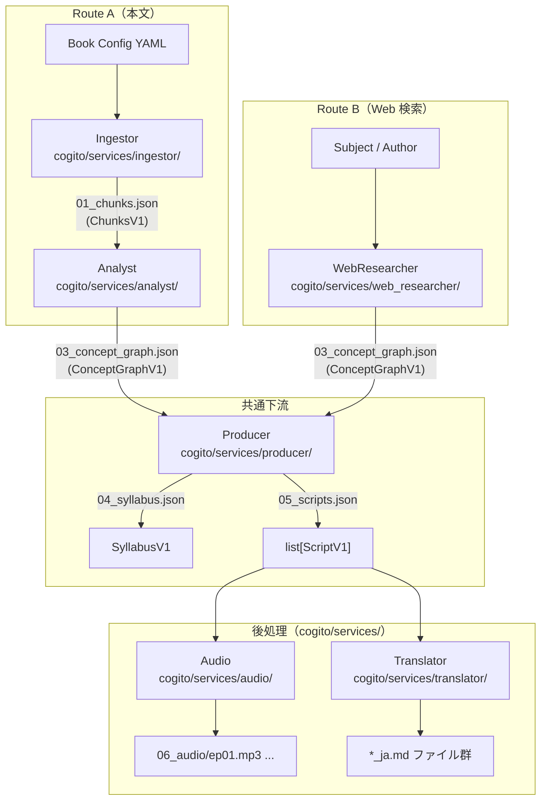

# アーキテクチャ — マイクロサービス構成

Project Cogito のサービス設計・スキーマ・データフローの全体像。

---

## 設計思想

### 解決する問題
- 全ロジックが単一の LangGraph State に依存していたモノリス構造
- 任意のステップの独立テストが困難
- 本文なし（Web検索のみ）でのコンセプトグラフ生成ができない

### アプローチ: ファイルベースのマイクロサービス

各サービスは **JSON ファイル** を入出力インターフェースとして独立。
オーケストレーションは **LangGraph**（SQLite チェックポイント付き）が担う。

```
サービスA ──JSON──▶ サービスB ──JSON──▶ サービスC
                                        ↑
                             LangGraph が状態管理・再開を制御
```

---

## 入力ルート

### Route A — 本文テキスト

```
Book Config YAML
     │
     ▼
[Ingestor]  ──── 01_chunks.json (ChunksV1)
     │
     ▼
[Analyst]
  ├── extractor.py   … チャンクごとの概念・アポリア・関係抽出
  └── synthesizer.py … 全チャンク分析 → ConceptGraphV1 統合
     │
     ▼
03_concept_graph.json (ConceptGraphV1)
```

### Route B — Web 検索

本のテキストが入手できない場合。題名・著者を与えるだけで **Web 検索から ConceptGraph を自動生成** する。

```
Subject / Author / Book Config
     │
     ▼
[WebResearcher]
  ├── planner.py    … 見出しリストを決定（設定 or LLM 推定）
  ├── searcher.py   … 各見出しでクエリ生成 → Web 検索（Tavily/DDG）
  ├── aggregator.py … 検索結果を LLM で段落に要約
  └── synthesizer.py… SYNTHESIS_PROMPT で ConceptGraphV1 生成
     │
     ▼
03_concept_graph.json (ConceptGraphV1)
```

### 共通下流（両ルート合流点）

```
03_concept_graph.json (ConceptGraphV1)
     │
     ▼
[Producer]
  ├── planner.py … ConceptGraphV1 → SyllabusV1  (04_syllabus.json)
  └── podcast.py … SyllabusV1    → list[ScriptV1] (05_scripts.json)
     │
     ├──▶ [Audio]      … Scripts → MP3 (06_audio/)
     └──▶ [Translator] … 中間出力 → *_ja.md
```

---

## サービス一覧

| サービス | モジュール | 入力 | 出力 |
|---|---|---|---|
| **Ingestor** | `cogito/services/ingestor/` | Book Config YAML | `ChunksV1` |
| **Analyst** | `cogito/services/analyst/` | `ChunksV1` | `ConceptGraphV1` |
| **WebResearcher** | `cogito/services/web_researcher/` | Subject / Author / Book | `ConceptGraphV1` |
| **Producer** | `cogito/services/producer/` | `ConceptGraphV1` | `SyllabusV1` + `list[ScriptV1]` |
| **Audio** | `cogito/services/audio/` | `list[ScriptV1]` + PersonaConfig | MP3 ファイル群 |
| **Translator** | `cogito/services/translator/` | `.md` ファイル群 | `*_ja.md` ファイル群 |
| **Orchestrator** | `cogito/orchestrator/` | CLI 引数 | 全体パイプライン実行 |

---

## コアスキーマ（Pydantic v2）

スキーマは `cogito/schemas/` で定義され、全サービスが共有する。

### ConceptGraphV1 ← 全サービスの合流点

```python
class ConceptGraphV1(BaseModel):
    schema_version: str = "1.0"
    subject: str                     # 著作名・テーマ
    source_mode: Literal["book", "web_researcher"]
    generated_by: Literal["analyst", "web_researcher"]

    concepts:  list[Concept]         # 10〜20 概念
    relations: list[ConceptRelation] # 8〜12 関係
    aporias:   list[Aporia]          # 4〜8 未解決の問い
    logic_flow: str
    core_frustration: str
```

> `source_mode` フィールドにより Route A / Route B どちらで生成されたかを追跡できる。下流の Producer はどちらも同一処理する。

**ネストされたモデル:**

```python
class Concept(BaseModel):
    id: str                          # "methodical_doubt"
    name: str                        # "Methodical Doubt"
    description: str
    original_quotes: list[str]       # 原文引用 2-4 個
    source_chunk: str                # "PART IV" or "COMBINED"

class ConceptRelation(BaseModel):
    source: str                      # Concept ID
    target: str                      # Concept ID
    relation_type: Literal["depends_on", "contradicts", "evolves_into"]
    evidence: str

class Aporia(BaseModel):
    id: str
    question: str
    context: str
    related_concepts: list[str]      # Concept ID リスト
```

### ChunksV1 (Ingestor → Analyst)

```python
class ChunksV1(BaseModel):
    schema_version: str = "1.0"
    source_type: Literal["book", "gutenberg", "url", "local_file", "web"]
    subject: str
    chunks: list[Chunk]   # id, text, metadata
```

### SyllabusV1 / ScriptV1 (Producer 出力)

```python
class SyllabusV1(BaseModel):
    mode: str             # essence | curriculum | topic
    episodes: list[Episode]
    meta_narrative: str

class ScriptV1(BaseModel):
    episode_number: int
    title: str            # 日本語タイトル
    opening_bridge: str
    dialogue: list[DialogueLine]   # [{speaker, line}]
    closing_hook: str
```

### PersonaConfig (Producer 設定)

```python
class PersonaConfig(BaseModel):
    persona_a: Persona
    persona_b: Persona
    voice: dict[str, int]   # VOICEVOX speaker ID マッピング
```

---

## ディレクトリ構成

```
cogito/
├── config/                        # 設定ローダー
│   └── book_config.py             # config/books/<name>.yaml のロード・検証
│
├── utils/                         # 共有ユーティリティ
│   └── logger.py                  # create_step, extract_json, flush_log
│
├── schemas/                       # 共有スキーマ（インターフェース契約）
│   ├── chunks.py                  # ChunksV1
│   ├── concept_graph.py           # ConceptGraphV1
│   └── production.py              # SyllabusV1, ScriptV1, PersonaConfig
│
├── services/
│   ├── ingestor/                  # Route A 前半: 本文 → ChunksV1
│   │   ├── adapters/book.py       # Gutenberg / local / URL / arxiv 取得 + チャンク化
│   │   ├── adapters/arxiv_client.py  # arXiv フルテキスト取得
│   │   └── cli.py
│   │
│   ├── analyst/                   # Route A 後半: ChunksV1 → ConceptGraphV1
│   │   ├── extractor.py           # チャンク別概念抽出
│   │   ├── synthesizer.py         # 概念グラフ合成
│   │   └── cli.py
│   │
│   ├── web_researcher/            # Route B: Web → ConceptGraphV1
│   │   ├── planner.py             # 見出し決定
│   │   ├── searcher.py            # クエリ生成・Web 検索
│   │   ├── aggregator.py          # 検索結果 → 段落要約
│   │   ├── synthesizer.py         # ConceptGraphV1 生成（SYNTHESIS_PROMPT 再利用）
│   │   ├── web_search.py          # Tavily / DuckDuckGo API
│   │   └── cli.py
│   │
│   ├── producer/                  # 下流: ConceptGraphV1 → Syllabus + Scripts
│   │   ├── planner.py             # SyllabusV1 生成
│   │   ├── podcast.py             # ScriptV1 生成（日本語対話）
│   │   └── cli.py
│   │
│   ├── audio/                     # 後処理: Scripts → MP3（VOICEVOX）
│   │   ├── voicevox_client.py     # VOICEVOX Engine HTTP クライアント
│   │   └── synthesizer.py         # エピソードごとの MP3 生成
│   │
│   └── translator/                # 後処理: EN → JA 翻訳
│       └── translator.py          # TranslateGemma 12B 統合
│
└── orchestrator/                  # 統合エントリーポイント（LangGraph）
    ├── state.py                   # CogitoState TypedDict
    ├── graph.py                   # LangGraph StateGraph トポロジー
    ├── cli.py                     # CLI パーサー + 実行ロジック
    └── __main__.py                # python -m cogito.orchestrator 用

config/
├── books/<name>.yaml              # 書籍設定
└── personas.yaml                  # ペルソナプリセット

tests/
├── test_schemas.py
├── test_analyst.py
├── test_ingestor.py
├── test_producer.py
└── test_web_researcher.py
```

---

## プロンプト継承関係

新サービスは旧モノリスのプロンプトを移植・再利用しており、品質劣化がない。

| プロンプト | モジュール |
|---|---|
| `ANALYSIS_PROMPT` | `cogito/services/analyst/extractor.py` |
| `SYNTHESIS_PROMPT` | `cogito/services/analyst/synthesizer.py` ← `web_researcher/synthesizer.py` が再利用 |
| `ESSENCE/CURRICULUM/TOPIC_PROMPT` | `cogito/services/producer/planner.py` |
| `SCRIPT_PROMPT` | `cogito/services/producer/podcast.py` |

> `SYNTHESIS_PROMPT` を WebResearcher が再利用することで、Route A・Route B どちらの `ConceptGraphV1` も **完全に同一のスキーマ** が保証される。

---

## LangGraph トポロジー

```
ingest
  └─▶ analyze_chunks
        └─▶ synthesize_graph
              ├─[book mode]──▶ produce
              └─[web mode]───▶ web_research ──▶ produce
                                                    ├─[not skip_audio]──▶ synthesize_audio ──▶ check_translate
                                                    └─[skip_audio]─────▶ check_translate
                                                                              ├─[not skip_translate]──▶ translate ──▶ END
                                                                              └─[skip_translate]─────▶ END
```

チェックポイントは `data/checkpoints.db` に SQLite 形式で保存される。
`--resume RUN_ID` で中断したランをノードレベルで再開できる。

---

## データフロー全体図



---

## テスト

```bash
python -m pytest tests/ -v
```

| テストファイル | 内容 |
|---|---|
| `test_schemas.py` | ChunksV1 / ConceptGraphV1 / SyllabusV1 の JSON シリアライズ・変換 |
| `test_ingestor.py` | Ingestor サービスの統合テスト |
| `test_analyst.py` | Analyst サービス（extractor + synthesizer）の統合テスト |
| `test_producer.py` | Producer サービス（planner + podcast）の統合テスト |
| `test_web_researcher.py` | WebResearcher サービスの統合テスト |
