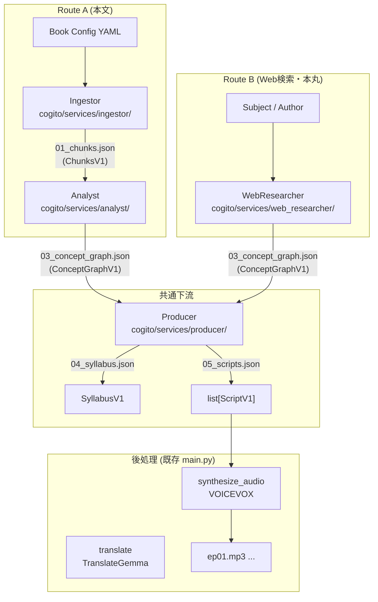

# アーキテクチャ v2 — マイクロサービス構成

Project Cogito のマイクロサービスアーキテクチャの全体像。

> [!NOTE]
> 従来のモノリシック `main.py` / LangGraph パイプラインは **引き続き動作します**。新旧は並行して共存しています。

---

## 設計思想

### 問題: モノリス `main.py`
- 全ロジックが単一の LangGraph State に依存
- 任意のステップの独立テストが困難
- 本文なし（Web検索のみ）でのコンセプトグラフ生成ができない

### 解決: ファイルベースのマイクロサービス

各サービスは **JSON ファイル** を入出力インターフェースとして独立させる。

```
サービスA ──JSON──▶ サービスB ──JSON──▶ サービスC
```

これによってサービス単体でのテスト・実行が可能になり、お互いを知る必要がなくなる。

---

## 入力ルート

### Route A — 本文テキスト

```
Book Config YAML
     │
     ▼
[Ingestor]  ──── 01_chunks.json (ChunksV1)
     │
     ▼
[Analyst]   ──── 03_concept_graph.json (ConceptGraphV1)
```

### Route B — Web検索（本丸）

本のテキストが入手できない場合。本の題名・著者を与えるだけで **Web 検索から ConceptGraph を自動生成** する。

```
Subject / Author / Book Config
     │
     ▼
[WebResearcher]
  ├── Planner   … 見出しリストを決定（設定 or LLM 推定）
  ├── Searcher  … 各見出しでクエリ生成 → Web 検索 (Tavily/DDG)
  ├── Aggregator… 検索結果をLLMで段落に要約
  └── Synthesizer… SYNTHESIS_PROMPTで ConceptGraphV1 生成
     │
     ▼
03_concept_graph.json (ConceptGraphV1)
```

### 共通下流 (両ルート合流点)

```
03_concept_graph.json
     │
     ▼
[Producer]
  ├── Planner   … ConceptGraphV1 → SyllabusV1 (04_syllabus.json)
  └── Podcast   … SyllabusV1 → list[ScriptV1] (05_scripts.json)
```

---

## サービス一覧

| サービス | モジュール | 入力 | 出力 |
|---|---|---|---|
| **Ingestor** | `cogito/services/ingestor/` | Book Config YAML | `ChunksV1` |
| **Analyst** | `cogito/services/analyst/` | `ChunksV1` | `ConceptGraphV1` |
| **WebResearcher** | `cogito/services/web_researcher/` | Subject/Author/Book | `ConceptGraphV1` |
| **Producer** | `cogito/services/producer/` | `ConceptGraphV1` | `SyllabusV1` + `list[ScriptV1]` |
| **Orchestrator** | `cogito/orchestrator/` | CLI 引数 | 全体パイプライン実行 |

---

## コアスキーマ（Pydantic v2）

スキーマは `cogito/schemas/` で定義され、全サービスが共有する。

### ConceptGraphV1 ← 全サービスの合流点

```python
class ConceptGraphV1(BaseModel):
    schema_version: str = "1.0"
    subject: str                     # 著作名・テーマ
    source_mode: Literal["book", "web_researcher"]
    generated_by: Literal["analyst", "web_researcher"]

    concepts:  list[Concept]         # 10〜20 概念
    relations: list[ConceptRelation] # 8〜12 関係
    aporias:   list[Aporia]          # 4〜8 未解決の問い
    logic_flow: str
    core_frustration: str

    # 後方互換メソッド
    def to_legacy_dict(self) -> dict: ...
    def from_legacy_dict(cls, data, ...) -> ConceptGraphV1: ...
```

> [!IMPORTANT]
> `source_mode` フィールドにより、Route A（本文）と Route B（Web検索）のどちらで生成されたかを追跡できる。下流の Producer はこのフィールドを問わず同一の処理を行う。

### ChunksV1 (Ingestor → Analyst)

```python
class ChunksV1(BaseModel):
    schema_version: str = "1.0"
    source_type: Literal["book", "gutenberg", "url", "local_file", "web"]
    subject: str
    chunks: list[Chunk]   # id, text, metadata
```

### SyllabusV1 / ScriptV1 (Producer 出力)

```python
class SyllabusV1(BaseModel):
    mode: str             # essence | curriculum | topic
    episodes: list[Episode]
    meta_narrative: str

class ScriptV1(BaseModel):
    episode_number: int
    title: str            # 日本語タイトル
    opening_bridge: str
    dialogue: list[DialogueLine]   # [{speaker, line}]
    closing_hook: str
```

### PersonaConfig (Producer 設定)

```python
class Persona(BaseModel):
    name: str; role: str; description: str
    tone: str; speaking_style: str

class PersonaConfig(BaseModel):
    persona_a: Persona
    persona_b: Persona
    voice: dict[str, int]   # VOICEVOX speaker ID マッピング
```

---

## ディレクトリ構成

```
cogito/
├── schemas/                       # 共有スキーマ（インターフェース契約）
│   ├── __init__.py                # 公開API
│   ├── chunks.py                  # ChunksV1
│   ├── concept_graph.py           # ConceptGraphV1
│   └── production.py              # SyllabusV1, ScriptV1, PersonaConfig
│
├── services/
│   ├── ingestor/                  # Route A 前半: 本文 → ChunksV1
│   │   ├── adapters/book.py       # Gutenberg / local / URL 取得 + チャンク化
│   │   └── cli.py                 # CLI: python -m cogito.services.ingestor
│   │
│   ├── analyst/                   # Route A 後半: ChunksV1 → ConceptGraphV1
│   │   ├── extractor.py           # チャンク別概念抽出
│   │   ├── synthesizer.py         # 概念グラフ合成 (SYNTHESIS_PROMPT)
│   │   └── cli.py                 # CLI: python -m cogito.services.analyst
│   │
│   ├── web_researcher/            # Route B（本丸）: Web → ConceptGraphV1
│   │   ├── planner.py             # 見出し決定
│   │   ├── searcher.py            # クエリ生成・Web検索
│   │   ├── aggregator.py          # 検索結果→段落要約
│   │   ├── synthesizer.py         # ConceptGraphV1 生成 (SYNTHESIS_PROMPT再利用)
│   │   └── cli.py                 # CLI: python -m cogito.services.web_researcher
│   │
│   └── producer/                  # 下流: ConceptGraphV1 → Syllabus + Scripts
│       ├── planner.py             # SyllabusV1 生成 (ESSENCE/CURRICULUM/TOPIC プロンプト)
│       ├── podcast.py             # ScriptV1 生成 (SCRIPT_PROMPT)
│       └── cli.py                 # CLI: python -m cogito.services.producer
│
└── orchestrator/                  # 統合エントリーポイント
    └── cli.py                     # CLI: python -m cogito.orchestrator

src/                               # 旧モノリス（変更なし・並行稼働中）
├── reader/                        # ← Ingestor/Analyst の原本
├── director/                      # ← Producer の原本
├── dramaturg/                     # ← Producer の原本
├── researcher/                    # web_search.py は WebResearcher が再利用
└── ...

tests/
└── test_schemas.py                # 9 passed / 1 skipped
```

---

## プロンプト継承関係

新サービスは `src/` 内の既存プロンプトを移植・再利用しており、品質劣化がない。

| プロンプト | 旧ソース | 新ソース |
|---|---|---|
| `ANALYSIS_PROMPT` | `src/reader/analyst.py` | `cogito/services/analyst/extractor.py` |
| `SYNTHESIS_PROMPT` | `src/reader/synthesizer.py` | `cogito/services/analyst/synthesizer.py` + **`web_researcher/synthesizer.py`が再利用** |
| `ESSENCE/CURRICULUM/TOPIC_PROMPT` | `src/director/planner.py` | `cogito/services/producer/planner.py` |
| `SCRIPT_PROMPT` | `src/dramaturg/scriptwriter.py` | `cogito/services/producer/podcast.py` |

> [!TIP]
> `SYNTHESIS_PROMPT` を WebResearcher が再利用することで、Route A・Route B どちらの `ConceptGraphV1` も **完全に同一のスキーマ**が保証される。

---

## データフロー全体図



---

## 後方互換性

新サービスが生成した `ConceptGraphV1` は既存 `main.py` に渡せる：

```bash
# WebResearcherで生成
python -m cogito.services.web_researcher --book descartes_discourse \
    --output data/run_xxx/03_concept_graph.json

# 既存 main.py で後続を実行
python main.py --book descartes_discourse \
    --resume run_xxx --from-node plan
```

`ConceptGraphV1` の `to_legacy_dict()` / `from_legacy_dict()` が変換を担う。

---

## テスト

```bash
python -m pytest tests/test_schemas.py -v
# → 9 passed, 1 skipped
```

| テスト | 内容 |
|---|---|
| `TestChunksV1::test_roundtrip_json` | JSON シリアライズ/デシリアライズ |
| `TestChunksV1::test_to_raw_chunks` | 旧形式との互換 |
| `TestConceptGraphV1::test_from_legacy_dict` | 旧 ConceptGraph dict → V1 変換 |
| `TestConceptGraphV1::test_to_legacy_dict_roundtrip` | V1 → 旧形式 → V1 |
| `TestConceptGraphV1::test_web_researcher_source_mode` | source_mode フィールド |
| `TestSyllabusV1::test_from_legacy_dict` | 旧 Syllabus dict → V1 変換 |
