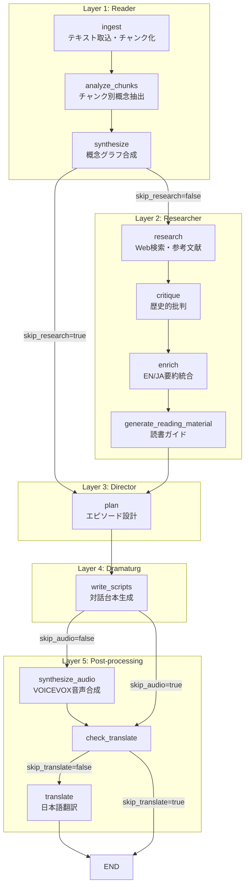

# パイプラインアーキテクチャ

哲学テキストを分析し、日本語ポッドキャスト台本・音声を自動生成する LangGraph パイプライン。

---

## データフロー概要

```
  ┌─────────┐   ┌──────────┐   ┌───────────┐
  │ Ingest  │──▶│ Analyze  │──▶│ Synthesize│──┐
  │ (取込)  │   │ (分析)   │   │ (合成)    │  │
  └─────────┘   └──────────┘   └───────────┘  │
  テキスト取得   チャンク別      統合コンセプト  │
  & チャンク化   概念抽出        グラフ生成      │
                                               │
       ┌───────────────────────────────────────┘
       │  --skip-research で 3b〜3e をスキップ
       ▼
  ┌──────────┐   ┌──────────┐   ┌──────────┐   ┌──────────┐
  │ Research │──▶│ Critique │──▶│ Enrich   │──▶│ Reading  │
  │ (研究)   │   │ (批評)   │   │ (統合)   │   │ Material │
  └──────────┘   └──────────┘   └──────────┘   └──────────┘
  Web検索 +      歴史的批判      EN/JA要約      包括的
  参考文献       の生成          の統合         読書ガイド
                                                    │
  ┌─────────────────────────────────────────────────┘
  │
  ▼
  ┌──────────┐   ┌──────────┐   ┌──────────┐   ┌──────────┐
  │ Plan     │──▶│ Script   │──▶│ Audio    │──▶│ Translate│
  │ (設計)   │   │ (台本)   │   │ (音声)   │   │ (翻訳)   │
  └──────────┘   └──────────┘   └──────────┘   └──────────┘
  エピソード      日本語対話      VOICEVOX       中間出力の
  構成設計        台本生成        音声合成        日本語翻訳
```

---

## LangGraph グラフ構造

`src/graph.py` で定義される StateGraph。全ノードがグラフ内にあり、条件分岐で skip フラグに応じたルーティングを行う。



### 条件分岐

| 分岐ポイント | フラグ | true のとき | false のとき |
|-------------|--------|------------|-------------|
| `synthesize` の後 | `--skip-research` | `plan` へ直行 | `research` → `critique` → `enrich` → `generate_reading_material` → `plan` |
| `write_scripts` の後 | `--skip-audio` | `check_translate` へ直行 | `synthesize_audio` → `check_translate` |
| `check_translate` の後 | `--skip-translate` | `END` | `translate` → `END` |

### チェックポイント

LangGraph の `SqliteSaver` を使い、各ノード完了後に state を SQLite DB に永続化する。これにより：

- **中断再開**: `Ctrl-C` で中断しても `--resume <run_id>` で最後に完了したノードから再開できる
- **部分再実行**: `--resume <run_id> --from-node <node>` で指定ノードから再実行できる（例: モデル変更後のスクリプト再生成）
- チェックポイントは `data/<run_id>/checkpoint.sqlite` に保存される

---

## ノード詳細

### Layer 1: Reader（テキスト分析）

| ノード | 役割 | 入力 | 出力 | LLM |
|--------|------|------|------|-----|
| `ingest` | テキスト取得・チャンク分割 | 書籍設定 YAML | `raw_chunks` | なし |
| `analyze_chunks` | チャンク別の概念・アポリア・論証抽出 | `raw_chunks` | `chunk_analyses` | Reader モデル x N回 |
| `synthesize` | 全チャンクの分析を統合し概念グラフ構築 | `chunk_analyses` | `concept_graph` | Reader モデル x 1回 |

**ingest** はテキストソース（`gutenberg` / `local_file` / `url`）からテキストを取得し、チャンク分割戦略（`regex` / `chapter` / `heading` / `token`）で分割する。取得済みテキストは `data/` にキャッシュされる。

**analyze_chunks** は各チャンクから7次元の構造を抽出する：概念、アポリア、関係、論理の流れ、論証構造、哲学的手法、修辞的戦略。チャンクは逐次処理される（Ollama は Apple Silicon で並行リクエスト非対応）。

**synthesize** は概念の重複排除、クロスチャンク関係の構築、コア・フラストレーション（著作全体の根本的緊張）の特定を行い、`ConceptGraph` を生成する。

### Layer 2: Researcher（外部情報収集） ※ `--skip-research` でスキップ

| ノード | 役割 | 入力 | 出力 | LLM |
|--------|------|------|------|-----|
| `research` | Web検索 + 参考文献要約 → 研究文脈統合 | 書籍設定の検索クエリ | `research_context` | Reader モデル x (1 + 参考文献数) |
| `critique` | 概念ごとの歴史的批判・反論・再解釈 | `concept_graph`, `research_context` | `critique_report` | Reader モデル x 1回 |
| `enrich` | 研究 + 批評を EN/JA 要約に統合 | `research_context`, `critique_report` | `enrichment` | Reader モデル x 1回 |
| `generate_reading_material` | 包括的読書ガイド生成 | 全ステージの出力 | `reading_material` | Reader モデル x (2 + チャンク数) |

**research** は Tavily（優先）/ DuckDuckGo（フォールバック）で Web 検索し、参考文献ファイルを LLM で要約した上で、5カテゴリ（伝記、歴史的文脈、出版経緯、批判的受容、現代的意義）に整理する。

**critique** は `notable_critics` に指定された批評家（例: パスカル、ヒューム）の視点から各概念への批判を生成する。

**enrich** は研究と批評の大量データを、英語要約（800〜1200語）・日本語要約（1500〜2500字）・批判的視点（400〜800字）に圧縮する。下流の `plan` と `write_scripts` に注入される。

**generate_reading_material** は Gemini Deep Research スタイルの学習ガイドを、アブストラクト → 章別分析 → 総合的結論 → 参考文献の構成で生成する。

### Layer 3: Director（構成設計）

| ノード | 役割 | 入力 | 出力 | LLM |
|--------|------|------|------|-----|
| `plan` | モードに応じたエピソード構成設計 | `concept_graph`, `enrichment` | `syllabus` | Reader モデル x 1回 |

3つのモード：

| モード | エピソード数 | 説明 |
|--------|-------------|------|
| `essence` | 1 | 著作の核心アポリアに焦点を当てた単一エピソード |
| `curriculum` | 6 | 著作の論理的進行に沿った全6回シリーズ |
| `topic` | 1〜2 | 指定トピックに関連する概念を深掘り |

### Layer 4: Dramaturg（台本生成）

| ノード | 役割 | 入力 | 出力 | LLM |
|--------|------|------|------|-----|
| `write_scripts` | 2人のペルソナによる日本語対話台本生成 | `syllabus`, `concept_graph`, `persona_config`, `enrichment` | `scripts` | Dramaturg モデル x エピソード数 |

台本は3幕構成（導入3分 / 掘り下げ5分 / 統合2分）で、合計50〜65発言を目標とする。ペルソナは `config/personas.yaml` から読み込まれる。

### Layer 5: Post-processing

| ノード | 役割 | 入力 | 出力 | LLM |
|--------|------|------|------|-----|
| `synthesize_audio` | VOICEVOX で台本を音声合成 | `scripts`, `persona_config` | `audio_metadata` | なし（VOICEVOX API） |
| `check_translate` | ルーティング接点（no-op） | — | — | — |
| `translate` | 英語中間出力の日本語翻訳 | ファイルシステム上の .md ファイル | `*_ja.md` ファイル | Translator モデル x セクション数 |

**synthesize_audio** は VOICEVOX Engine（`localhost:50021`）に HTTP 経由で合成を依頼し、pydub で MP3 にエクスポートする。話者交代時に無音（600〜1800ms）を挿入する。

**translate** は `02_chunk_analyses.md`, `03_concept_graph.md`, `04_syllabus.md` を TranslateGemma でセクション単位（最大3000文字/チャンク）で日本語に翻訳する。

---

## State スキーマ

パイプライン全体で単一の `CogitoState`（TypedDict）が受け渡される。LangGraph の checkpointer が各ノード完了後にこの state を永続化する。

```python
class CogitoState(TypedDict):
    # 設定
    book_config: dict           # 書籍設定 YAML の内容
    book_title: str             # 書籍タイトル
    mode: str                   # "essence" | "curriculum" | "topic"
    topic: str | None           # topic モード時のトピック
    persona_config: dict        # ペルソナ設定
    reader_model: str           # Reader/Director 層のモデル名
    dramaturg_model: str        # Dramaturg 層のモデル名
    translator_model: str       # 翻訳ステージのモデル名
    work_description: str       # LLM プロンプト用の作品説明文

    # 実行メタデータ
    run_dir: str                # 出力ディレクトリ（str: Path は serialize 不可）
    run_id: str                 # 実行 ID（run_YYYYMMDD_HHMMSS）

    # フラグ
    skip_research: bool         # 研究ステージをスキップ
    skip_audio: bool            # 音声合成をスキップ
    skip_translate: bool        # 翻訳をスキップ

    # データ成果物
    raw_chunks: list[str]       # Stage 1: テキストチャンク
    chunk_analyses: list[dict]  # Stage 2: チャンク別分析
    concept_graph: dict         # Stage 3: 統合コンセプトグラフ
    research_context: dict      # Stage 3b: 研究文脈
    critique_report: dict       # Stage 3c: 批評レポート
    enrichment: dict            # Stage 3d: EN/JA 統合要約
    reading_material: str       # Stage 3e: 読書ガイド（Markdown）
    syllabus: dict              # Stage 4: エピソード計画
    scripts: list[dict]         # Stage 5: 対話台本
    audio_metadata: list[dict]  # Stage 6: 音声メタデータ

    # ログ
    thinking_log: list[dict]    # 全 LLM コールの記録
```

---

## 出力ディレクトリ構成

各実行は `data/run_YYYYMMDD_HHMMSS/` に保存される。

```
data/run_20260212_100013/
├── 01_chunks.json              # テキストチャンク（機械読み取り用）
├── 01_chunks.md                # テキストチャンク（人間読み取り用）
├── 02_chunk_analyses.json      # チャンク別分析結果
├── 02_chunk_analyses.md        # チャンク別分析レポート
├── 02_chunk_analyses_ja.md     # 〃 日本語版（translate）
├── 03_concept_graph.json       # 統合コンセプトグラフ
├── 03_concept_graph.md         # 統合コンセプトグラフレポート
├── 03_concept_graph_ja.md      # 〃 日本語版（translate）
├── 03b_research_context.json   # リサーチ結果
├── 03b_research_context.md     # リサーチレポート
├── 03c_critique_report.json    # 批評レポート
├── 03c_critique_report.md      # 批評レポート
├── 03d_enriched_context.json   # 統合コンテキスト
├── 03d_enriched_context.md     # 統合コンテキストレポート
├── 03e_reading_material.md     # 包括的読書ガイド
├── 04_syllabus.json            # エピソード計画
├── 04_syllabus.md              # エピソード計画レポート
├── 04_syllabus_ja.md           # 〃 日本語版（translate）
├── 05_scripts.json             # 対話台本
├── 05_scripts.md               # 対話台本レポート
├── 06_audio/                   # 音声ファイル
│   ├── ep01.mp3
│   └── ...
├── 06_audio.json               # 音声メタデータ
└── checkpoint.sqlite           # LangGraph チェックポイント（--resume 用）
```

LLM コールのログは `logs/run_YYYYMMDD_HHMMSS.json` に別途保存される（→ [log-format-guide.md](log-format-guide.md)）。

---

## ソースコード構成

```
project-root/
├── main.py                          # CLI エントリポイント、LangGraph ストリーム実行
├── requirements.txt                 # Python 依存パッケージ
├── .env.example                     # 環境変数テンプレート
│
├── config/
│   ├── personas.yaml                # ペルソナプリセット定義
│   └── books/
│       └── descartes_discourse.yaml # 書籍設定（デカルト方法序説）
│
├── src/
│   ├── models.py                    # CogitoState（LangGraph State）+ Pydantic モデル
│   ├── graph.py                     # LangGraph StateGraph 定義、条件分岐、checkpointer
│   ├── logger.py                    # 思考ログシステム、JSON 抽出ユーティリティ
│   ├── book_config.py               # 書籍設定 YAML ローダー
│   ├── translator.py                # translate ノード + TranslateGemma 翻訳エンジン
│   │
│   ├── reader/                      # Layer 1: Reader（テキスト分析）
│   │   ├── ingestion.py             #   ingest ノード
│   │   ├── analyst.py               #   analyze_chunks ノード
│   │   └── synthesizer.py           #   synthesize ノード
│   │
│   ├── researcher/                  # Layer 2: Researcher（外部情報収集）
│   │   ├── web_search.py            #   Tavily / DuckDuckGo 検索エンジン
│   │   ├── reference_loader.py      #   参考文献ファイルの読み込み・要約
│   │   ├── researcher.py            #   research ノード
│   │   └── reading_material.py      #   generate_reading_material ノード
│   │
│   ├── critic/
│   │   └── critic.py                # critique ノード
│   │
│   ├── director/                    # Layer 3: Director（構成設計）
│   │   ├── enricher.py              #   enrich ノード
│   │   └── planner.py               #   plan ノード
│   │
│   ├── dramaturg/                   # Layer 4: Dramaturg（台本生成）
│   │   └── scriptwriter.py          #   write_scripts ノード
│   │
│   └── audio/                       # Layer 5: Post-processing（音声合成）
│       ├── voicevox_client.py       #   VOICEVOX Engine HTTP クライアント
│       └── synthesizer.py           #   synthesize_audio ノード
│
├── data/                            # データ（テキストキャッシュ、実行出力）
│   ├── pg59.txt                     #   Project Gutenberg キャッシュ
│   └── run_YYYYMMDD_HHMMSS/        #   各実行の出力ディレクトリ
│
├── logs/                            # LLM コールログ
│   └── run_YYYYMMDD_HHMMSS.json
│
└── docs/                            # ドキュメント
    ├── architecture.md              #   本ファイル（アーキテクチャ全体像）
    ├── usage-guide.md               #   インストール・設定・実行方法
    ├── llm-pipeline-flow.md         #   LLM 呼び出しの詳細
    ├── log-format-guide.md          #   ログファイルの解説
    ├── data-schema-reference.md     #   各ステージの JSON スキーマ
    ├── prompt-templates-reference.md #  プロンプトテンプレートの詳細
    └── debugging-guide.md           #   デバッグ手順書
```
