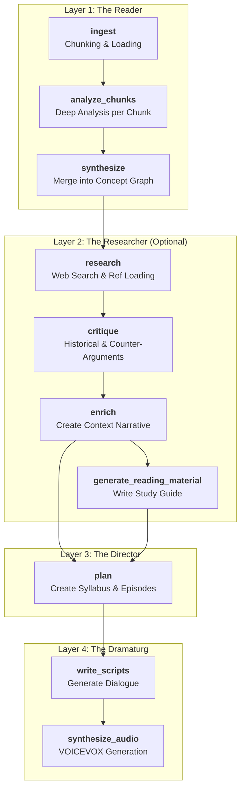

# Editorial Design & System Architecture

This document outlines the **LangGraph architecture** of the Cogito pipeline. The system is designed as a directed graph of specialized agents (Nodes), grouped into logical Layers.

## System Architecture (LangGraph Topology)

The pipeline is a linear graph where data flows from raw text ingestion to final audio synthesis.

---

## Detailed Node Roles

### Layer 1: The Reader (Input Processing)
Responsible for reading the raw text and extracting structured meaning.

*   **`ingest`**:
    *   **Role**: Librarian.
    *   **Input**: Raw text files or PDF.
    *   **Action**: Cleans text and splits it into manageable "chunks" (by Part/Chapter).
    *   **Output**: List of raw text chunks.

*   **`analyze_chunks`**:
    *   **Role**: Analytic Philosopher.
    *   **Input**: Single text chunk.
    *   **Action**: Extracts Concepts, Aporias (unresolved questions), and Argument Structures from *just that chunk*.
    *   **Output**: List of independent chunk analyses.

*   **`synthesize`**:
    *   **Role**: Systematizer.
    *   **Input**: All chunk analyses.
    *   **Action**: Merges duplicate concepts, maps cross-chapter relationships, and identifies the core "Frustration" of the work.
    *   **Output**: **Concept Graph** (The central knowledge base).

### Layer 2: The Researcher (Context Expansion)
Responsible for looking *outside* the book to understand history and reception.

*   **`research`**:
    *   **Role**: Research Assistant.
    *   **Action**: Google Search (via API) for author bio, historical context; loads external PDFs.
    *   **Output**: Research Context.

*   **`critique`**:
    *   **Role**: Devil's Advocate / Historian.
    *   **Action**: Takes the Concept Graph and finds historical criticisms and counter-arguments for each main idea.
    *   **Output**: Critique Report.

*   **`enrich`**:
    *   **Role**: Editor.
    *   **Action**: Compresses the massive Research and Critique data into concise summaries (Japanese/English) for downstream agents.
    *   **Output**: Enriched Context.

*   **`generate_reading_material`**:
    *   **Role**: Academic Writer.
    *   **Action**: Uses all available data to write a comprehensive, chapter-by-chapter study guide (Markdown).
    *   **Output**: Reading Material (MD file).

### Layer 3: The Director (Editorial Strategy)
Responsible for deciding *how* to present the content.

*   **`plan`**:
    *   **Role**: Podcast Showrunner.
    *   **Action**: Selects a subset of Concepts/Aporias from the Graph. Decides the Theme, Cognitive Bridge (modern relevance), and Cliffhanger for each episode.
    *   **Output**: **Syllabus** (Episode Plan).

### Layer 4: The Dramaturg (Creative Production)
Responsible for generating the final user-facing content.

*   **`write_scripts`**:
    *   **Role**: Screenwriter.
    *   **Action**: Turns the Episode Plan into a natural, engaging dialogue between two Personas (e.g., Minori & Tuto), incorporating the Enriched Context.
    *   **Output**: Dialogue Scripts (JSON).

*   **`synthesize_audio`**:
    *   **Role**: Sound Engineer.
    *   **Action**: Sends the dialogue to the local VOICEVOX engine to generate WAV/MP3 files.
    *   **Output**: Audio Files.

---

## Data Artifacts (Intermediate Outputs)

The pipeline saves the state after each major step to `data/run_ID/`.

1.  `01_chunks.md`: Raw text segments.
2.  `02_chunk_analyses.md`: Raw extraction results.
3.  `03_concept_graph.md`: The unified map of ideas.
4.  `03d_enriched_context.md`: The background knowledge injected into scripts.
5.  `04_syllabus.md`: The episode plan.
6.  `05_scripts.md`: The final text of the podcast.