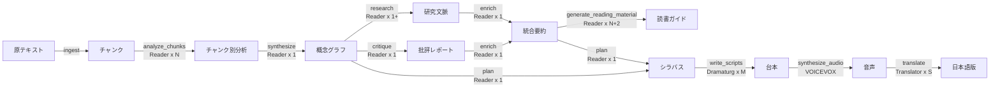

# LLM パイプラインフロー

各ノードが LLM をどのように呼び出すかの詳細。プロンプトチューニングやデバッグの参考資料。

---

## 概要

パイプライン全体で3種類の LLM モデルを使い分ける。

| モデル種別 | CLI 引数 | デフォルト | 用途 |
|-----------|---------|-----------|------|
| Reader モデル | `--reader-model` | `llama3` | 分析・合成・研究・批評・統合・設計（構造化 JSON 出力） |
| Dramaturg モデル | `--dramaturg-model` | `qwen3-next` | 日本語対話台本生成（創造的テキスト出力） |
| Translator モデル | `--translator-model` | `translategemma:12b` | 英→日翻訳 |

---

## ノード別 LLM 呼び出し詳細

### `analyze_chunks` — チャンク別概念抽出

| 項目 | 内容 |
|------|------|
| **LLM ロール** | 哲学的テキストの解釈学的分析者 |
| **呼び出し回数** | N 回（チャンク数） |
| **モデル設定** | Reader モデル、temperature=0.1、format="json" |
| **入力コンテキスト** | チャンクのテキスト（〜20k文字）、part_id、key_terms（書籍設定から） |
| **プロンプト戦略** | 7次元の構造化抽出を指示（概念、アポリア、関係、論理の流れ、論証構造、哲学的手法、修辞的戦略） |
| **出力形式** | JSON: `{concepts: [], aporias: [], relations: [], arguments: [], rhetorical_strategies: [], logic_flow: ""}` |
| **state 更新** | `chunk_analyses` に追加 |
| **ソース** | `src/reader/analyst.py` |

**注意**: チャンクは逐次処理される。Ollama は Apple Silicon 上で並行リクエストに非対応。

### `synthesize` — 概念グラフ合成

| 項目 | 内容 |
|------|------|
| **LLM ロール** | 分析結果を統合するシステマタイザー |
| **呼び出し回数** | 1 回 |
| **モデル設定** | Reader モデル、temperature=0.1、format="json" |
| **入力コンテキスト** | 全チャンク分析の圧縮サマリー、作品情報 |
| **プロンプト戦略** | 概念の重複排除（目標10〜20概念）、クロスチャンク関係の構築（目標8〜12関係）、コア・フラストレーションの特定、アポリアの保全（目標4〜8） |
| **出力形式** | `ConceptGraph` JSON（Pydantic でバリデーション） |
| **state 更新** | `concept_graph` |
| **ソース** | `src/reader/synthesizer.py` |

### `research` — 研究コンテキスト統合

| 項目 | 内容 |
|------|------|
| **LLM ロール** | リサーチアシスタント |
| **呼び出し回数** | 1 回（統合）+ 参考文献ファイル数（要約） |
| **モデル設定** | Reader モデル |
| **入力コンテキスト** | Web 検索結果（Tavily / DuckDuckGo）、参考文献のテキスト |
| **プロンプト戦略** | 複数ソースを5カテゴリに整理: 著者伝記、歴史的文脈、出版経緯、批判的受容、現代的意義 |
| **出力形式** | `ResearchContext` JSON |
| **state 更新** | `research_context` |
| **ソース** | `src/researcher/researcher.py`, `src/researcher/web_search.py`, `src/researcher/reference_loader.py` |

### `critique` — 歴史的批判生成

| 項目 | 内容 |
|------|------|
| **LLM ロール** | 哲学史家 / Devil's Advocate |
| **呼び出し回数** | 1 回 |
| **モデル設定** | Reader モデル |
| **入力コンテキスト** | 概念グラフ、研究文脈、`notable_critics`（書籍設定から） |
| **プロンプト戦略** | 各主要概念について歴史的批判、反論、現代的再解釈を生成。指定された批評家（例: パスカル、ヒューム、カント）の視点を活用 |
| **出力形式** | `CritiqueReport` JSON |
| **state 更新** | `critique_report` |
| **ソース** | `src/critic/critic.py` |

### `enrich` — 統合コンテキスト生成

| 項目 | 内容 |
|------|------|
| **LLM ロール** | 背景ブリーフィングの作成者 |
| **呼び出し回数** | 1 回 |
| **モデル設定** | Reader モデル |
| **入力コンテキスト** | 研究文脈全体、批評レポート全体 |
| **プロンプト戦略** | 大量の研究・批評データを3つの成果物に圧縮 |
| **出力形式** | JSON: `{enrichment_summary: "EN...", enrichment_summary_ja: "JA...", critique_perspectives_ja: "JA..."}` |
| **state 更新** | `enrichment` |
| **データフロー** | 下流の `plan` と `write_scripts` のプロンプトに直接注入される |
| **ソース** | `src/director/enricher.py` |

### `generate_reading_material` — 包括的読書ガイド

| 項目 | 内容 |
|------|------|
| **LLM ロール** | 学術ライター |
| **呼び出し回数** | 1回（アブストラクト）+ N回（章別分析）+ 1回（結論） |
| **モデル設定** | Reader モデル |
| **入力コンテキスト** | パイプライン全ステージの出力（チャンク、分析、研究、批評） |
| **プロンプト戦略** | 反復的生成。アブストラクト → 各チャンクの詳細エッセイ → 総合的結論。各章に該当する批評家の視点を注入 |
| **出力形式** | Markdown ドキュメント（`03e_reading_material.md`） |
| **state 更新** | `reading_material` |
| **ソース** | `src/researcher/reading_material.py` |

### `plan` — エピソード設計

| 項目 | 内容 |
|------|------|
| **LLM ロール** | ポッドキャストのショーランナー |
| **呼び出し回数** | 1 回 |
| **モデル設定** | Reader モデル、temperature=0.3、format="json" |
| **入力コンテキスト** | 概念グラフ全体、モード設定、enrichment（あれば） |
| **プロンプト戦略** | 概念グラフからエピソード別に概念・アポリアをキュレーション。各エピソードに Cognitive Bridge（現代との接点）と Cliffhanger を設定 |
| **出力形式** | `Syllabus` JSON: `{mode: "", episodes: [...], meta_narrative: ""}` |
| **state 更新** | `syllabus` |
| **ソース** | `src/director/planner.py` |

### `write_scripts` — 対話台本生成

| 項目 | 内容 |
|------|------|
| **LLM ロール** | 一流のポッドキャスト台本作家 |
| **呼び出し回数** | M 回（エピソード数） |
| **モデル設定** | Dramaturg モデル、temperature=0.7、num_ctx=32768 |
| **入力コンテキスト（重い）** | ペルソナ詳細、エピソード計画、概念の定義と原文引用、enrichment の日本語要約と批判的視点、3幕構成指示 |
| **プロンプト戦略** | 日本語のみで書くことを厳格に指示。原文を直接引用せず自分の言葉で言い換えること。歴史的批判に言及すること。エピソード間の連続性を維持すること |
| **出力形式** | `Script` JSON: `{episode_number, title, opening_bridge, dialogue: [{speaker, line}], closing_hook}` |
| **state 更新** | `scripts` |
| **ソース** | `src/dramaturg/scriptwriter.py` |

### `translate` — 日本語翻訳

| 項目 | 内容 |
|------|------|
| **LLM ロール** | 英日プロフェッショナル翻訳者 |
| **呼び出し回数** | S 回（翻訳対象ファイルのセクション数合計） |
| **モデル設定** | Translator モデル、temperature=0.1、num_ctx=8192 |
| **入力コンテキスト** | 英語のマークダウンセクション（最大3000文字/チャンク） |
| **プロンプト戦略** | 哲学用語の正確な翻訳。マークダウン書式の維持。作品のコンテキスト（`work_description`）を提供 |
| **翻訳対象** | `02_chunk_analyses.md`, `03_concept_graph.md`, `04_syllabus.md` → `*_ja.md` |
| **ソース** | `src/translator.py` |

---

## LLM 呼び出し回数の総計

| 構成 | Reader 呼び出し | Dramaturg 呼び出し | Translator 呼び出し |
|------|----------------|-------------------|-------------------|
| essence + skip-research | N + 3 | 1 | 0 |
| essence + full | N + 9 + N' | 1 | S |
| curriculum + full | N + 9 + N' | 6 | S |

- N = テキストチャンク数（通常 4〜8）
- N' = reading_material のチャンク別生成回数
- S = 翻訳セクション数（ファイル長に依存）
