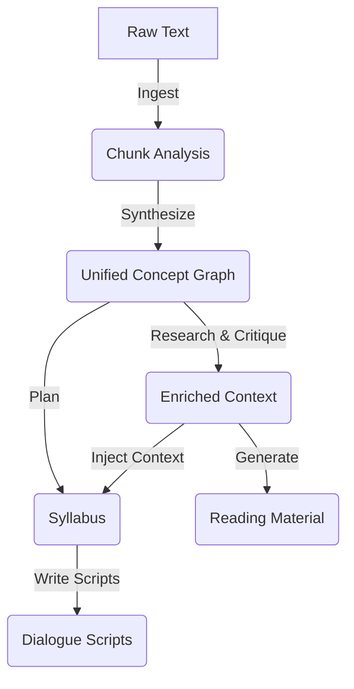

# LLM Pipeline Flow & Data Architecture

This document describes the Cogito pipeline from the perspective of the Large Language Models (LLMs). It details **where** LLMs are invoked, **what context** they receive, **how many times** they are called, and **how data flows** between stages.

## System Overview

The pipeline transforms raw text into structured knowledge (Concept Graph), enriches it with external research, and finally transmutes it into creative outputs (Podcasts, Study Guides).

---

## Stage 1: The Reader (Analysis & Synthesis)

The "Reader" layer is responsible for deep hermeneutic analysis. It uses a smaller, logical model (default: `llama3`) to extract structured data.

### 1.1 Chunk Analysis (`analyze_chunks`)
*   **Goal**: Extract atomic philosophical structures from a single text segment.
*   **LLM Identity**: "A philosopher performing deep hermeneutic analysis."
*   **Calls**: `N` times (once per text chunk).
*   **Input Context**:
    *   `text`: The raw text of the chunk (~20k chars max).
    *   `part_id`: Identifier (e.g., "Part I").
    *   `key_terms`: Optional list of terms to look for.
*   **Prompt Strategy**: Strict extraction instruction. Explicitly asks for "Concepts", "Aporias" (unresolved tensions), "Argument Structures", and "Logic Flow".
*   **Output**: JSON object containing lists of concepts, aporias, relations, arguments, and rhetorical strategies.
*   **Data Flow**: Outputs are aggregated into `state["chunk_analyses"]`.

### 1.2 Synthesis (`synthesize`)
*   **Goal**: Merge fragmental analyses into a coherent whole.
*   **LLM Identity**: "A synthesizer merging chunk-level analyses."
*   **Calls**: `1` time.
*   **Input Context**:
    *   `analyses_json`: A compressed summary of ALL chunk analyses.
    *   `work_description`: Title and author.
*   **Prompt Strategy**:
    *   **Deduplication**: Merge identical concepts found in different chunks.
    *   **Connection**: Build a graph of relations (e.g., "Concept A in Part 1 leads to Concept B in Part 4").
    *   **Core Frustration**: Identify the single driving tension of the entire work.
*   **Output**: `ConceptGraph` (JSON) - The central knowledge artifact of the system.
*   **Data Flow**: Saved to `state["concept_graph"]`. This graph drives all downstream creativity.

---

## Stage 2: The Researcher (Context & Critique)

This optional layer adds external perspective. It moves beyond the text itself to understand history and reception.

### 2.1 Research Integration (`research`)
*   **Goal**: Create a factual background document.
*   **LLM Identity**: "A research assistant."
*   **Calls**: `1` time (plus 1 per reference file if used).
*   **Input Context**:
    *   `web_results`: Raw text from search engine results.
    *   `reference_summaries`: Summaries of uploaded PDFs/texts.
*   **Prompt Strategy**: Synthesize disparate sources into 5 categories: Biography, Historical Context, Publication History, Critical Reception, Modern Significance.
*   **Output**: `ResearchContext` (JSON).

### 2.2 Critique Generation (`critique`)
*   **Goal**: Simulate a "Devil's Advocate" to find weaknesses in the Concept Graph.
*   **LLM Identity**: "A historian of philosophy."
*   **Calls**: `1` time.
*   **Input Context**:
    *   `concept_graph`: The internal structure of the book.
    *   `research_context`: The external facts.
    *   `notable_critics`: List of specific critics (e.g., "Pascal", "Hume") defined in config.
*   **Prompt Strategy**: For each major concept, generate Historical Criticisms, Counter-arguments, and Modern Reinterpretations.
*   **Output**: `CritiqueReport` (JSON).

### 2.3 Enrichment (`enrich`)
*   **Goal**: Compress the vast research/critique data into a narrative usable by the Scriptwriter.
*   **LLM Identity**: "Background briefing creator."
*   **Calls**: `1` time.
*   **Input Context**: Full `ResearchContext` and `CritiqueReport`.
*   **Prompt Strategy**: Generate three specific artifacts:
    1.  `enrichment_summary` (English narrative).
    2.  `enrichment_summary_ja` (Japanese narrative for script injection).
    3.  `critique_perspectives_ja` (Bullet points for dialogue use).
*   **Output**: `Enrichment` (JSON).
*   **Data Flow**: These summaries are directly injected into the System Prompt of the Scriptwriter.

---

## Stage 3: The Director (Planning)

### 3.1 Syllabus Planning (`plan`)
*   **Goal**: Curate the Concept Graph into an episodic arc.
*   **LLM Identity**: "A podcast director."
*   **Calls**: `1` time.
*   **Input Context**:
    *   `concept_graph`: The full map of ideas.
    *   `mode`: `essence` (1 ep), `curriculum` (6 eps), or `topic` (focused).
    *   `enrichment_summary`: Background context.
*   **Prompt Strategy**: Select a subset of Concepts and Aporias for each episode. Define a "Cognitive Bridge" (connection to modern life) and a "Cliffhanger".
*   **Output**: `Syllabus` (JSON) containing a list of `Episode` objects.

---

## Stage 4: The Dramaturg (Scripting)

This layer generates the final content. It uses a creative, multilingual model (default: `qwen2.5` or `qwen3-next`).

### 4.1 Scriptwriting (`write_scripts`)
*   **Goal**: Turn an episode plan into a natural, engaging Japanese dialogue.
*   **LLM Identity**: "A top-tier podcast scriptwriter."
*   **Calls**: `M` times (once per episode).
*   **Input Context** (Heavy Context):
    *   **Personas**: Detailed character sheets (Tone, Style, Role) for Host A and Host B.
    *   **Episode Plan**: Theme, specific Concepts/Aporias to cover.
    *   **Concept Details**: Definitions and *original quotes* for the selected concepts.
    *   **Enrichment**: The Japanese research summary and critique points.
    *   **Structure**: 3-Act structure (Intro -> Deep Dive -> Synthesis).
*   **Prompt Strategy**:
    *   Strict instruction to write **only in Japanese**.
    *   Requirement to quote the original text.
    *   Requirement to incorporate historical criticisms (from Enrichment).
*   **Output**: `Script` (JSON) containing dialogue lines.

---

## Stage 5: Reading Material (Bonus)

### 5.1 Comprehensive Guide (`generate_reading_material`)
*   **Goal**: Write a "Deep Research" style academic paper.
*   **LLM Identity**: "An academic writer."
*   **Calls**: `1` (Abstract) + `N` (Chapters) + `1` (Conclusion).
*   **Input Context**:
    *   Full State (Chunks, Analyses, Research, Critique).
    *   Specific `PART_CRITICS` map (e.g., "In Part 3, mention Pascal's criticism").
*   **Prompt Strategy**: Iterative generation. Write an abstract, then write a detailed essay for *each* chunk, then write a conclusion.
*   **Output**: A single Markdown document (`03e_reading_material.md`).
